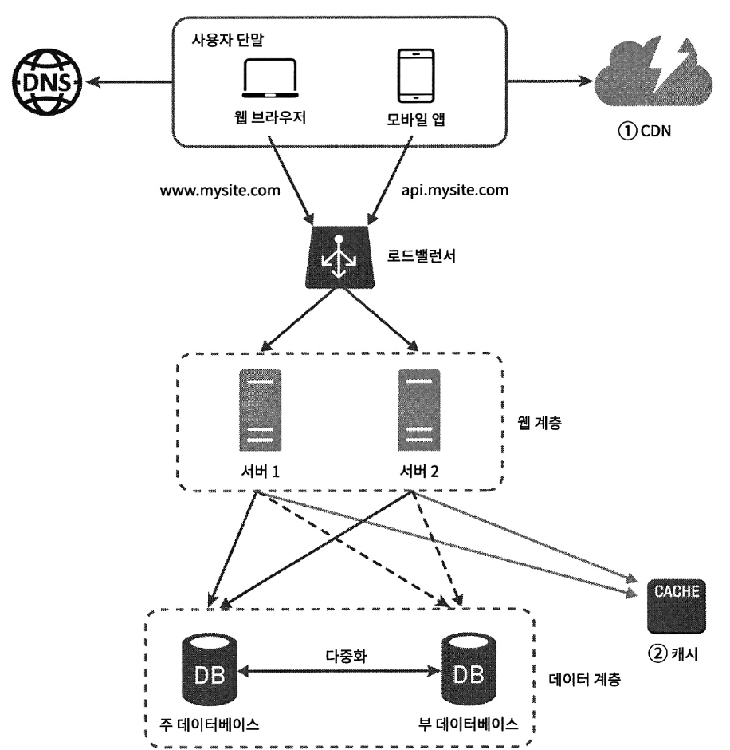
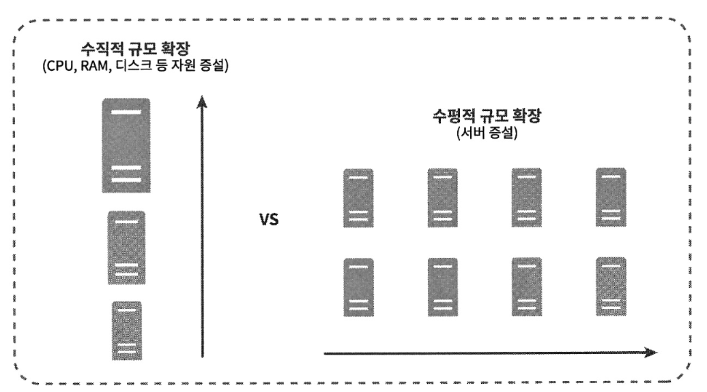

## 1장 사용자 수에 따른 규모 확장성

---

### 단일 서버
- 단일 서버 시스템

> 1. 사용자가 도메인 이름을 이용해서 웹 사이트에 접속한다.
  >    - 이 때, 도메인 이름을 DNS(도메인 이름 서비스)에 질의하여 IP 주소로 변환된다.
> 2. DNS 조회 결과로 IP 주소(웹 서버 주소) 반환한다.
> 3. 해당 IP 주소로 HTTP 요청을 전달한다.
> 4. 요청받은 웹 서버는 HTML 페이지나 JSON 형태로 응답을 반환한다.

- 요청 단말 종류
  - 웹 애플리케이션 : 비즈니스 로직, 데이터 저장 등을 처리하기 위해 서버 구현용 언어(Java, Python 등)와 프레젠테이션용을 위해 클라이언트 구현용 언어(HTML, JavaScript 등) 사용
  - 모바일 앱 : 모바일 앱과 웹 서버 간 통신을 위해 HTTP 프로토콜 이용, HTTP 프로토콜을 통해 반환될 응답 데이터는 보통 JSON 포맷 사용  

### 데이터베이스

- 웹 서버 : 웹/모바일 트래픽 처리용 (웹 계층)
- 데이터베이스 서버 : 데이터베이스용 (데이터 계층)  

- 관계형 데이터베이스 (RDBMS)
  - 자료를 테이블, 열, 컬럼으로 표현한다.
  - SQL을 사용하여 테이블 관계를 Join 할 수 있다.
  - Ex) MySQL, 오라클, PostgreSQL

- 비관계형 데이터베이스 (NoSQL)
  - 종류 : 키-값 저장소, 그래프 저장소, 컬럼 저장소, 문서 저장소
  - Join을 지원하지 않는다.
  - Ex) CouchDB, Neo4j, Cassandra, HBase, Amazon DynamoDB

- 비관계형 데이터베이스가 적합한 경우
  - 아주 낮은 응답 지연시간(latency)이 요구되는 경우
  - 데이터가 비정형(unstructured)인 경우
  - 데이터(JSON, YAML, XML 등)를 직렬화(seialize)하거나 역직렬화(deseialize) 할 수 있기만 하면 되는 경우
  - 아주 많은 양의 데이터를 저장해야 하는 경우

### 수직적 규모 확장 vs 수평적 규모 확장
- 수직적 규모 확장
    - 스케일 업 (Scale-Up)
    - 서버에 고사양 자원(CPU, RAM 등)을 추가하여 성능을 개선하는 방식이다.
    - 트래픽 양이 적을 때 적합하다.
    - 장점 : 단순함
    - 단점 : 확장의 한계, 자원을 무한대로 증설이 불가능, 장애 자동복구나 다중화 방안이 없음

- 수평적 규모 확장
    - 스케일 아웃 (Scale-Out)
    - 더 많은 서버를 추가하여 성능을 개선하는 방식이다.
    - 대규모 서비스에 적합하다.

- 로드밸런서 (웹 계층 장애 대응 방안)

  - 로드밸런서 : 부하 분산 집합(Load Balancing Set)에 속한 웹 서버들에게 트래픽 부하를 고르게 분산하는 역할을 한다.

  - 사용자는 로드밸런서의 공개 IP 주소로 접속하고, 서버 간 통시에는 사설 IP 주소를 이용한다.
      - 웹 서버는 클라이언트의 접속을 직접 처리하지 않는다.
      - 사설 IP 주소는 같은 네트워크에 속한 서버 사이의 통신에만 사용하고, 인터넷을 통해 접속할 수 없다.
  

  - 로드밸런서를 통해 장애 자동 복구 문제가 해소되며, 웹 계층의 가용성이 향상된다.

  - 서버 1이 다운되면 모든 트래픽이 서버 2로 전송되기 때문에 웹 사이트 전체가 다운되는 일이 방지된다.

  - 부하를 나누기 위해 새로운 서버를 추가할 수 있다.

  - 웹 사이트로 유입되는 트래픽이 가파르게 증가하면 웹 서버 계층에 더 많은 서버를 추가하여 로드밸런서가 자동적으로 트래픽을 분산하도록 하면 된다.

- 데이터베이스 다중화 (데이터 계층 장애 대응 방안)
  - 많은 데이터베이스 관리 시스템이 다중화를 지원하고 있다.
  - 서버 사이에 **주(Master)-부(Slave)** 관계를 설정하고, 데이터 원본은 주 서버, 사본은 부 서버에 저장하는 방식이다.
    - 주 서버(Master) : 쓰기 연산(Write Operation)
    - 부 서버(Slave) : 읽기 연산(Read Operation), 주 서버 사본
  - 대부분 애플리케이션은 ‘읽기 연산 > 쓰기 연산’이므로, **부 데이터베이스 수가 주 데이터베이스 수보다 많다.**

[장점]
- 더 나은 성능 : 모든 데이터 변경 연산은 주 서버에, 읽기 연산은 부 서버에 분산되기 때문에 병렬로 처리될 수 있는 질의(Query) 수가 늘어나므로 성능이 좋아진다.
- 안정성 : 데이터베이스 서버 가운데 일부가 파괴되어도 데이터가 보존된다.
- 가용성 : 하나의 데이터베이스 서버에 장애가 발생하더라도 다른 서버에 있는 데이터를 가져와 계속 서비스가 가능하다.

- [데이터베이스 서버가 다운되면 벌어지는 일]
  - 부 서버가 한 대인 경우 : 읽기 연산은 한시적으로 모두 주 서버에 전달되고, 새로운 부 서버가 장애 서버를 대체한다.
  - 부 서버가 여러 대인 경우 : 읽기 연산은 나머지 부 서버들로 분산되고, 새로운 부 서버가 장애 서버를 대체한다.
  - 주 데이터베이스 다운 & 부 서버 한 대인 경우 : 부 서버가 새로운 주 서버가 되고, 모든 데이터베이스 연산은 일시적으로 새로운 주 서버에서 수행된다, 새로운 부 서버 추가되고, 이 때 부 서버에 보관된 데이터가 최신 상태가 아닐 수 있기 때문에 없는 데이터는 복구 스크립트를 돌려서 추가해야 된다. (다중 마스터나 원형 다중화 방식을 도입하면 도움은 되지만 훨씬 복잡함)

> 1. 사용자는 DNS로부터 로드밸런서의 공개 IP 주소를 받음
> 2. 사용자는 해당 IP 주소로 로드밸런서에 접속
> 3. HTTP 요청은 서버 1이나 서버 2로 전달됨
> 4. 웹 서버는 사용자의 데이터를 부 서버에서 읽음
> 5. 웹 서버는 데이터 변경 연산을 주 서버에 전달 (추가, 삭제, 갱신 연산 등)

### 캐시

- 값비싼 연산 결과 또는 자주 참조되는 데이터를 메모리 안에 두고, 뒤이은 요청이 보다 빨리 처리될 수 있도록 하는 저장소이다.

- **캐시 계층 (Cache Tier)**
  - 데이터가 잠시 보관되는 곳이다.
  - 캐시 계층을 두면 성능이 개선되고, 데이터베이스 부하를 줄일 수 있고, 캐시 계층의 규모를 독립적으로 확장시킬 수 있다.
  > 1. 요청을 받은 웹 서버는 캐시에 응답이 저장되어 있는지 확인한다.
  > 2. 저장되어 있다면 해당 데이터 반환하고, 저장되어 있지 않다면 데이터베이스 질의를 통해 데이터를 찾아 캐시에 저장한 뒤 반환한다.  
  >   → **캐시 우선 읽기 전략 (Read-Through Caching Strategy)** : 캐시할 데이터 종류, 크기, 액세스 패턴에 따라 다양한 캐시 전략을 선택할 수 있다.

- [캐시 사용 시 유의할 점]
  - 캐시 적용하기 적합한 상황인지 : 데이터 갱신이 자주 일어나지 않지만 참조는 빈번하게 일어나는 경우 적합하다.
  - 어떤 데이터를 캐시에 둘 것인지 : 캐시는 데이터를 휘발성 메모리에 두기 때문에 영속적으로 보관할 데이터를 캐시에 저장하는 것은 바람직하지 않다.
  - 캐시 만료 정책 : 만료된 데이터는 삭제되어야 하기 때문에 캐시 만료 정책을 마련하는 것이 좋고, 만료 기한이 너무 짧으면 데이터베이스를 자주 읽게 되어 좋지 않고, 만료 기한이 너무 길면 원본과 데이터 차이가 날 수 있다.
  - 일관성 유지 방법 : 저장소의 원본을 갱신하는 연산과 캐시를 갱신하는 연산이 단일 트랜잭션으로 처리되지 않으면 일관성이 깨질 수 있다.
  - 장애 대처 방법 : 캐시 서버를 한 대만 두면 해당 서버는 단일 장애 지점(SPOF)이 될 수 있고, 이를 위해 캐시 서버를 분산시켜야 한다.
    - 단일 장애 지점(Single Point Of Failure, SPOF) : 어떤 특정 지점에서의 장애가 전체 시스템의 동작을 중단시켜버리는 경우
  - 캐시 메모리 크기 : 캐시 메모리가 너무 작으면 액세스 패턴에 따라서는 데이터가 자주 캐시에서 밀려나버려(Eviction) 캐시의 성능이 떨어지고, 이를 해결하기 위해 캐시 메모리를 과할당(Overprovision)하여 캐시에 보관될 데이터가 갑자기 늘어났을 때를 방지할 수 있도록 한다.
  - 데이터 방출 정책 : 캐시가 꽉 차버렸을 때 데이터를 넣어야 하는 경우 기존 데이터를 내보내야 한다. (캐시 데이터 방출 정책)
    - LRU(Least Recently Used) : 마지막으로 사용된 시점이 가장 오래된 데이터를 내보내는 정책
    - LFU(Least Frequently Used) : 사용된 빈도가 가장 낮은 데이터를 내보내는 정책
    - FIFO(First In First Out) : 가장 먼저 캐시에 들어온 데이터를 가장 먼저 내보내는 정책

### 콘텐츠 전송 네트워크 (CDN)
- CDN : 정적 콘텐츠를 전송하는 데 쓰이는 지리적으로 분산된 서버의 네트워크이다.
  - 이미지, 비디오, CSS, JavaScript 파일 등을 캐시할 수 있다.

- 동적 컨텐츠 캐싱 : 요청 경로, 질의 문자열, 쿠키, 요청 헤더 등의 정보에 기반하여 HTML 페이지를 캐시하는 것

- [CDN 동작 방법]

  - 사용자가 웹 사이트를 방문하면 사용자에게 가장 가까운 CDN 서버가 정적 콘텐츠를 전달한다.
  > 1. 사용자 A가 이미지 URL을 이용해 image.png에 접근한다.
  >   - URL의 도메인은 CDN 서비스에서 제공한 것이다.
  > 2. CDN 서버 캐시에 해당 이미지가 없는 경우, 서버는 원본 서버에 요청하여 파일을 가져온다.
  > 3. 원본 서버가 파일을 CDN에 반환함, 이 때 HTTP 헤더에 해당 파일이 얼마나 오래 캐시될 수 있는지 알려주는 TTL(Time-To-Live) 값이 들어있다.
  > 4. CDN 서버는 파일을 캐시하고 사용자 A에게 반환함, 이미지는 TTL에 명시된 시간이 끝날 때까지 캐시된다.
  > 5. 사용자 B가 동일한 이미지 요청을 CDN 서버에 전송한다.
  > 6. 만료되지 않은 이미지에 대한 요청은 캐시를 통해 처리된다.

- [CDN 사용 시 고려해야 할 사항]
  - 비용 : CDN은 데이터 전송 양에 따라 요금을 내기 때문에 자주 사용되지 않는 콘텐츠는 CDN 캐시에서 빼는 것이 좋다.
  - 적절한 만료 시한 설정 : 만료 시한이 너무 길면 콘텐츠의 신선도가 떨어지고, 너무 짧으면 원본 서버에 빈번히 접속해야 된다.
  - CDN 장애 대처 방안 : CDN 자체가 죽었을 경우, 서비스가 어떻게 동작해야 되는지 구성을 해야 한다.
  - 콘텐츠 무효화 방법 : 아직 만료되지 않은 콘텐츠여도 2가지 방법으로 삭제할 수 있고, CDN에서 제공하는 API를 이용하여 콘텐츠를 무효화하거나, 콘텐츠의 다른 버전을 서비스하도록 오브젝트 버저닝을 이용한다. (콘텐츠의 새로운 버전을 지정하기 위해서 URL 마지막에 버전 번호를 인자로 줌)

- 정적 콘텐츠(JS, CSS, 이미지 등)는 더 이상 웹 서버를 통해 서비스하지 않으며, CDN을 통해 제공하여 더 나은 성능을 보장한다.
- 캐시로 인해 데이터베이스 부하가 줄어든다.

### 무상태(Stateless) 웹 계층
- 웹 계층을 수평적으로 확장하기 위해서는 상태 정보(사용자 세션 데이터 등)를 웹 계층에서 제거해야 된다.

- 상태 정보를 RDBMS나 NoSQL 같은 지속성 저장소에 보관하고 필요할 때 가져오도록 설계하면 좋다. → 무상태 웹 계층

- [상태 정보 의존적인 아키텍처]
  - 상태 정보를 보관하는 서버는 클라이언트 정보 즉, 상태를 유지하여 요청들 사이에 공유되도록 한다.
    - 무상태 서버에는 이런 장치가 없다.

    - 사용자 A의 세션 정보나 프로파일 이미지 같은 상태 정보는 서버 1에 저장되고, 사용자 A를 인증하기 위해 HTTP 요청은 반드시 서버 1로 전송되어야 한다.
    - 즉, 같은 클라이언트의 요청은 항상 같은 서버로 전송되어야 한다.
    - 이러한 이유로 로드밸런서는 고정 세션 기능을 제공하는데, 이 기능은 로드밸런서에 부담을 주고, 로드밸런서 뒷단에 서버를 추가하거나 제거하기도 까다롭고, 서버 장애 처리도 복잡해진다.

- 무상태 아키텍처

  - 무상태 아키텍처는 사용자로부터의 HTTP 요청은 어떤 웹 서버로도 전달될 수 있다.
  - 웹 서버는 상태 정보가 필요할 경우, 공유 저장소로부터 데이터를 가져온다.
  - 상태 정보는 웹 서버로부터 물리적으로 분리되어 있다.
  - 이러한 구조는 단순하고, 안정적이며, 규모 확장이 쉽다.

- 세션 데이터를 웹 계층에서 분리하고 지속성 데이터 보관소에 저장한다.

- 공유 저장소는 RDBMS/캐시 시스템(Memcached/Redis)/NoSQL일 수 있는데, 위 구조에서는 NoSQL을 사용한다.
  - NoSQL을 사용하면 규모 확장이 간편하다.

- 자동 규모 확장(AutoScaling) : 트래픽 양에 따라 웹 서버를 자동으로 추가하거나 삭제하는 기능이다.

- 상태 정보가 웹 서버들로부터 제거되었으므로, 트래픽 양에 따라 웹 서버를 넣거나 빼기만 하면 자동으로 규모 확장이 가능하다.

- 가용성을 높이고 전 세계 어디서도 사용할 수 있도록 하기 위해서는 여러 데이터 센터를 지원하는 것이 필수이다.

### 데이터 센터
- 지리적 라우팅(geoDNS-rounting/geo-routing) : 장애가 없는 상황에서 가장 가까운 데이터 센터로 사용자를 안내한다.

- geoDNS : 사용자 위치에 따라 도메인 이름을 어떤 IP 주소로 변환할지 결정할 수 있도록 해주는 DNS 서비스이다.

- 데이터 센터 중, 하나에 장애가 발생하면 모든 트래픽은 장애가 없는 데이터 센터로 전송된다.

- [다중 데이터센터 아키텍처를 만들기 위해 해결해야 되는 기술적 난제]
  - 트래픽 우회 : 올바른 데이터 센터로 트래픽을 보내는 효과적인 방법을 찾아야 하고, GeoDNS는 사용자에게서 가장 가까운 데이터센터로 트래픽을 보낼 수 있도록 한다.
  - 데이터 동기화 : 데이터 센터마다 별도의 데이터베이스를 사용하고 있는 상황이라면, 장애가 자동으로 복구되어 트래픽이 다른 데이터베이스로 우회해도 원하는 데이터가 없을 수 있음, 이를 위해 여러 데이터 센터에 걸친 다중화가 필요하다.
  - 테스트와 배포 : 여러 데이터 센터를 사용하도록 시스템이 구성되면 여러 위치에서 테스트하는 것이 중요하고, 자동화된 배포 도구는 모든 데이터 센터에 동일한 서비스가 설치되도록 하는 데 중요한 역할을 한다.

- 시스템을 더 큰 규모로 확장하기 위해서는 시스템의 컴포넌트를 분리하여 각기 독릭접으로 확장될 수 있도록 해야 됨

### 메시지 큐
- 메시지 큐 : 메시지의 무손실(durability, 메시지 큐에 보관된 메시지는 소비자가 꺼낼 때까지 안전히 보관된다는 특성)을 보장하는 비동기 통신을 지원하는 컴포넌트이다.
  - 메시지 버퍼 역할, 비동기적으로 전송된다.

- 기본 아키텍처
  - **생산자/발행자(producer/publisher)**라고 불리는 입력 서비스가 메시지를 만들어 메시지 큐에 발행(publish)한다.
  - 큐는 **소비자/구독자(consumer/subscriber)**라고 불리는 서비스 혹은 서버가 연결되어 있는데, 메시지를 받아 그에 맞는 동작을 수행한다.

- 특징
  - 메시지 큐를 이용하면 서비스 또는 서버가 결합이 느슨해져 규모 확장성이 보장되어야 하는 안정적 애플리케이션을 구성하기 좋다.
  - 생산자는 소비자 프로세스가 다운되어 있어도 메시지를 발행할 수 있고, 소비자는 생산자 서비스가 가용한 상태가 아니더라도 메시지를 수신할 수 있다.
  - 생산자와 소비자 서비스의 규모는 각기 독립적으로 확장될 수 있다.
  - 큐의 크기가 커지면 더 많은 작업 프로세스를 추가해야 처리 시간을 줄일 수 있지만, 큐가 거의 항상 비어 있는 상태라면 작업 프로세스의 수는 줄일 수 있다.

### 로그, 메트릭 그리고 자동화
- 로그
  - 에러 로그를 모니터링하는 것은 중요하다.
  - 에러 로그는 서버 단위로 모니터링 할 수 있지만, 로그를 단일 서비스로 모아주는 도구를 활용하면 더 편리하다.

- 메트릭
  - 메트릭을 잘 수집하면 사업 현황에 관한 유용한 정보를 얻을 수 있고, 시스템 현재 상태를 손쉽게 파악할 수 있다.
  - [주요 메트릭]
    - 호스트 단위 메트릭 : CPU, 메모리, 디스크 I/O 등
    - 종합 메트릭 : 데이터베이스 계층의 성능, 캐시 계층의 성능 등
    - 핵심 비즈니스 메트릭 : 일별 능동 사용자, 수익, 재방문 등

- 자동화
  - 시스템이 크고 복잡해지면 생산성을 높이기 위해 자동화 도구를 활용해야 한다.

- 메시지 큐는 각 컴포넌트가 보다 느슨히 결합될 수 있도록 하고, 결함에 대한 내성을 높인다.
- 로그, 모니터링, 메트릭, 자동화 등 추가된다.

### 데이터베이스의 규모 확장
- 데이터베이스 규모 확장 방법 : 수직적 규모 확장법, 수평적 규모 확장법

- 수직적 확장 (스케일 업)
  - 기존 서버에 더 많은 또는 고성능의 자원(CPU, RAM, 디스크 등)을 증설하는 방법이다.
  - [약점]
    - 데이터베이스 서버 하드웨어는 한계가 있으므로, CPU, RAM 등을 무한 증설할 수 없다.
    - SPOF로 인한 위험성이 있다.
    - 비용이 많이 든다.

- 수평적 확장 (샤딩, Sharding)
  - 더 많은 서버를 추가함으로써 성능을 향상 시키는 방법이다.
  - 대규모 데이터베이스를 샤드(Shard) 라고 부르는 작은 단위로 분활하는 기술이다.
  - 모든 샤드는 같은 스키마를 쓰지만, 샤드에 보관되는 데이터 사이에는 중복이 없다.
  - 샤딩 전략을 구현할 때 고려해야 할 가장 중요한 것은 **샤딩 키(= 파티션 키)를 어떻게 정하느냐**이다.
  - 샤딩 키는 데이터가 어떻게 분산될지 정하는 키로, 하나 이상의 컬럼으로 구성된다.
  - 샤딩 키를 올바른 데이터베이스에 질의를 보내어 데이터 조회나 변경을 처리하므로 효율을 높일 수 있다.
  - 샤딩 키를 정할 때는 데이터를 고르게 분할할 수 있도록 해야 된다.

- [샤딩을 도입하면 생기는 문제]
  - 데이터의 재 샤딩(resharding) : 데이터가 너무 많아져서 하나의 샤드로는 더 이상 감당하기 어려울 때나 샤드 간 데이터 분포가 균등하지 못하여 어떤 샤드에 할당된 공간 소모가 다른 샤드에 비해 빨리 진행될 때(샤드 소진)는 샤드 키를 계산하는 함수를 변경하고 데이터를 재배치 해야된다.
    - 안정 해시 기법을 활용해서 해결할 수 있다.
  - 유명인사 문제(핫스팟 키 문제) : 특정 샤드에 질의가 집중되어 서버에 과부하가 걸리는 문제, 유명인사 각각에 샤드 하나씩을 할당하거나 더 잘게 쪼개어 해결하는 방법이 있다.
  - 조인과 비정규화 : 하나의 데이터베이스를 여러 샤드 서버로 쪼개고 나면, 여러 샤드에 걸친 데이터를 조인하기가 힘들어짐, 데이터베이스를 비정규화하여 하나의 테이블에서 질의가 수행될 수 있도록 한다.

### 백만 사용자, 그리고 그 이상
- 시스템 규모를 확장하는 것은 지속적이고 반복적인 과정이다.

> [정리]
> - 웹 계층은 무상태 계층으로
> - 모든 계층에 다중화 도입
> - 가능한 한 많은 데이터를 캐시할 것
> - 여러 데이터 센터를 지원할 것
> - 정적 콘텐츠는 CDN을 통해 서비스할 것
> - 데이터 계층은 샤딩을 통해 그 규모를 확장할 것
> - 각 계층은 독립적 서비스로 분할할 것
> - 시스템을 지속적으로 모니터링하고, 자동화 도구들을 활용할 것
