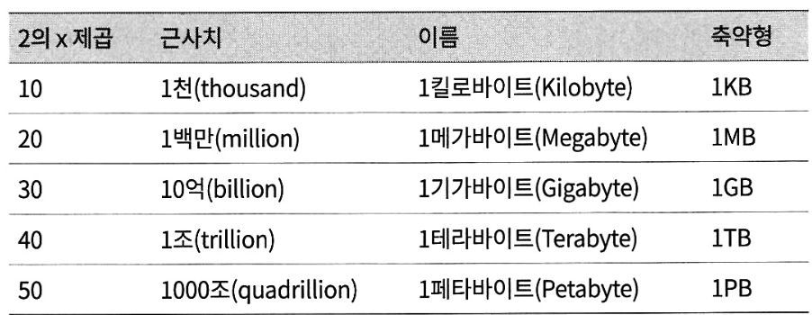
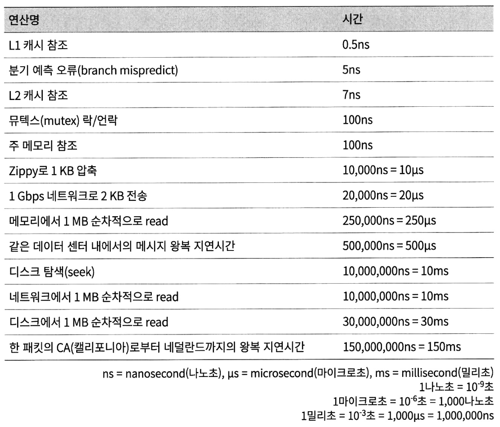
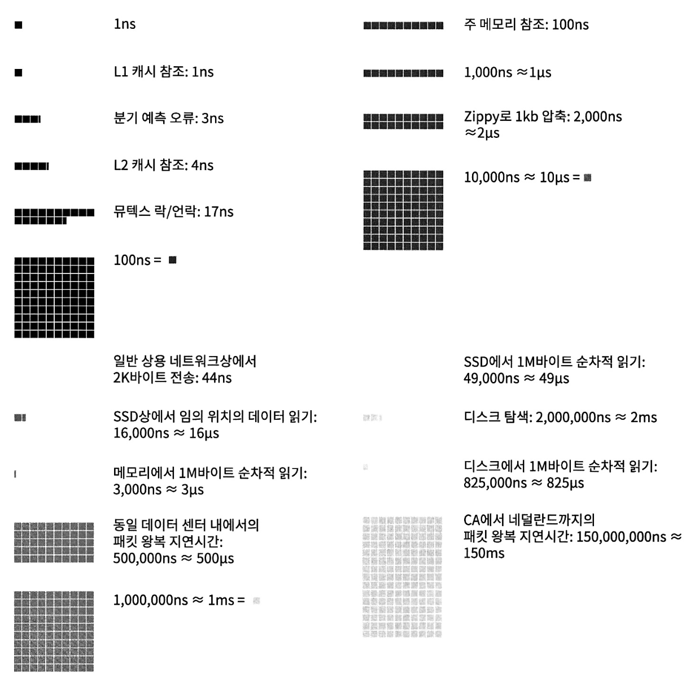
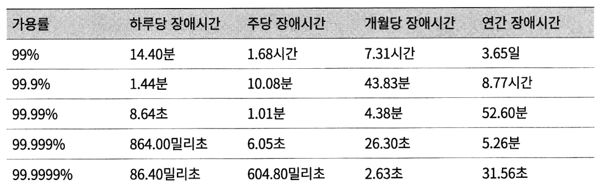

## 2장 개략적인 규모 추정

---

### 들어가기
- **개략적인 규모 추정(back-of-the-envelop estimation)** : 통용되는 성능 수치상에서 사고 실험을 행하여 추정치를 계산하는 행위로서, 어떤 설계가 요구사항에 부합할 것인지 보기 위한 것
- 개략적인 규모 추정을 효과적으로 하기 위해서는 **2의 제곱수**나 **응답지연 값**, **가용성에 관계된 수치**들을 기본적으로 잘 이해하고 있어야 한다.

### 2의 제곱수
- 분산 시스템에서 다루는 데이터양을 정확하게 계산하기 위해 **데이터 볼륨의 단위를 2의 제곱수로 표현하면 어떻게 되는지** 이해해야 한다.
    - 2의 제곱수는 최소 단위는 1바이트이고, 8비트로 구성된다.

- 흔히 쓰이는 데이터 볼륨 단위

### 모든 프로그래머가 알아야 하는 응답지연 값
- 통상적인 컴퓨터에서 구현된 연산들의 응답지연 값

- 시각화 버전

- 위 수치들을 분석한 결론은 다음과 같다.
  - 메모리는 빠르지만 디스크는 아직도 느리다.
  - 디스크 탐색(seek)은 가능한 한 피하라.
  - 단순한 압축 알고리즘은 빠르다.
  - 데이터를 인터넷으로 전송하기 전에 가능하면 압축하라.
  - 데이터 센터는 보통 여러 지역에 분산되어 있고, 센터들 간에 데이터를 주고받는 데는 시간이 걸린다.

### 가용성에 관계된 수치들
- 고가용성(High-Availability) : 시스템이 오랜 시간 동안 지속적으로 중단 없이 운영될 수 있는 능력
  - 퍼센트(%)로 표현한다.
  - 100%는 시스템이 단 한 번도 중단된 적이 없었음을 의미하는데, 대부분의 서비스는 99% ~ 100% 사이의 값을 갖는다.

- SLA(Service Level Agreement) : 서비스 사업자와 고객 사이에 맺어진 합의
  - SLA에는 서비스 사업자가 제공하는 서비스의 가용시간(uptime)이 공식적으로 기술되어 있다.
  - 아마존, 구글, 마이크로소프트 같은 사업자는 99% 이상의 SLA를 제공한다.

- 가용시간은 관습적으로 숫자 9를 사용해 표시한다.
- 9의 개수와 시스템 장애(downtime) 사이의 관계는 다음과 같다.

### 팁
- 개략적인 규모 추정과 관계된 면접에서 가장 중요한 것은 문제를 풀어 나가는 절차다. 해당 면접에서는 ‘문제 해결 능력’이 중요하다.

[ 개략적인 규모 추정과 관계된 면접 팁 ]
1. 근사치를 활용한 계산 (rounding and approximation)
   - 면접장에서 복잡한 계산을 하는 것은 어렵기 때문에 적절한 근사치를 활용하여 시간을 절약하자.
   - Ex) “99987/9.1” → “100,000/10”

2. 가정(assumption)들은 적어 두라.

3. 단위(unit)를 붙이라.

4. 많이 출제되는 개략적 규모 추정 문제는 QPS, 최대 QPS, 저장소 요구량, 캐시 요구량, 서버 수 등을 추정하는 것이다. 이런 값들을 계산하는 연습을 미리 하자.
